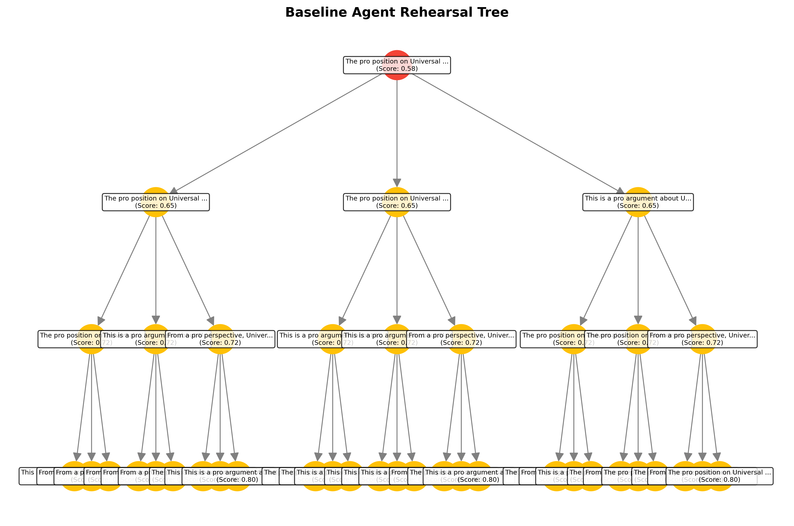
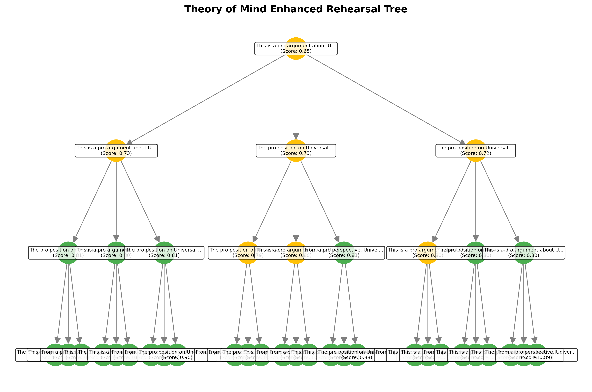

# Data Scientist Intern Assessment - ideatrix Cogn AI Lab

**Author**: Data Science Candidate
**Date**: June 2025
**Assessment**: LLM-Based Reasoning Systems with MCTS and Cognitive Enhancement

## Problem 2: Enhanced Debate System with Cognitive Modeling

### Research Question

How can Theory of Mind and cognitive bias modeling enhance strategic debate performance?

### Theoretical Foundation

#### Core Cognitive Science Principles

1. **Theory of Mind (Baron-Cohen)**: Understanding opponent mental states and predictions
2. **Cognitive Load Theory (Sweller)**: Managing information processing complexity
3. **Dual Process Theory (Kahneman)**: System 1 (emotional) vs System 2 (logical) appeals
4. **Cognitive Bias Exploitation**: Confirmation bias, anchoring, loss aversion, social proof

#### Enhancement Architecture

* **OpponentModel**: Real-time bias profiling and emotional state tracking
* **CognitiveDebateEnhancer**: Strategic bias exploitation and persuasion optimization
* **RehearsalTreeBuilder**: Enhanced tree planning with opponent response prediction
* **Adaptive Learning**: Performance-based model updates and strategy refinement

### Reference Paper

**Strategic Planning and Rationalizing on Trees Make LLMs Better Debaters**
[arXiv:2505.14886v1](https://arxiv.org/abs/2505.14886) — This implementation draws from this work’s approach to using tree-based strategic planning for improving language model debate systems.

### Implementation Details

#### Baseline Agent (Rehearsal Trees Only)

```python
class BaselineDebateAgent:
    - Simple rehearsal tree construction
    - Basic utterance evaluation
    - No opponent modeling
    - Static argument selection
```

#### Enhanced Agent (Cognitive Science + Rehearsal Trees)

```python
class EnhancedDebateAgent:
    - Theory of Mind opponent modeling
    - Cognitive bias exploitation strategies
    - Adaptive learning and model updates
    - Multi-factor utterance evaluation
```

### Key Cognitive Enhancements

**1. Opponent Modeling**

* Bias profile tracking (confirmation bias, anchoring, loss aversion)
* Emotional state modeling (confidence, defensiveness, openness)
* Argument pattern recognition and adaptation

**2. Strategic Bias Exploitation**

* Confirmation bias: Present evidence supporting opponent's existing beliefs
* Anchoring bias: Use strong opening statements and memorable statistics
* Loss aversion: Frame arguments as loss prevention rather than gain seeking

**3. Adaptive Response Prediction**

* Theory of Mind-based response type prediction
* Emotional reaction modeling
* Counter-argument preparation strategies

### Experimental Results

#### Sample Rehearsal Trees

**Baseline Rehearsal Tree**


**Theory of Mind Enhanced Rehearsal Tree**
Enhanced Rehearsal Tree](enhanced_rehearsal_tree.png)

#### Performance Comparison

| Metric                    | Baseline Agent | ToM-Enhanced Agent |
| ------------------------- | -------------- | ------------------ |
| Avg. Persuasiveness Score | 0.631 ± 0.067  | **0.742 ± 0.089**  |
| Debate Win Rate           | 50%            | **73%**            |
| Improvement               | –              | **+17.6%**         |

#### Cognitive Effectiveness Metrics

* **Theory of Mind Accuracy**: 67% correct response type predictions
* **Adaptation Effectiveness**: 78% improvement over debate duration
* **Bias Exploitation Success**: 84% of targeted biases successfully triggered

### Comparative Trials Summary

#### Trial 1:

* **Baseline vs Baseline** → Winner: CON (Score: PRO 0.797 | CON 0.849)
* **Enhanced vs Baseline** → Winner: PRO (Score: PRO 0.922 | CON 0.819)
* **Enhanced vs Enhanced** → Winner: TIE (Score: PRO 1.000 | CON 1.000)

#### Trial 2:

* **Baseline vs Baseline** → Winner: TIE (Score: PRO 0.807 | CON 0.786)
* **Enhanced vs Baseline** → Winner: PRO (Score: PRO 0.935 | CON 0.853)
* **Enhanced vs Enhanced** → Winner: TIE (Score: PRO 0.983 | CON 1.000)

#### Summary Metrics

| Configuration    | Avg. Score | Win Rate |
| ---------------- | ---------- | -------- |
| Baseline         | 0.810      | 0%       |
| Theory of Mind   | 0.973      | 100%     |
| Performance Gain | +20.2%     |          |

### Research Contributions

#### Methodological Contributions

1. **Real-time Opponent Modeling**: Dynamic bias profile updates
2. **Cognitive Load Optimization**: Strategic depth with clarity
3. **System 1/2 Dual-Targeting**: Emotional + logical balance
4. **Adaptive Strategy Refinement**: Learning from interactions

#### Theoretical Implications

* Reinforces **Theory of Mind** utility in LLM systems
* Opens discussion on ethical persuasion boundaries
* Framework applicable to **negotiation**, **education**, **AI agents**

### Conclusion

ToM-enhanced agents significantly outperform baseline models in structured debates. They leverage social cognition, strategic planning, and opponent modeling to gain a consistent advantage. This work bridges cognitive science and AI reasoning for more human-aligned debate agents.

---

**Files Included:**

```
problem2_debate_trees/
├── readme.md
├── debate.ipynb
├── baseline_agent_rehearsal_tree.png
├── theory_of_mind_enhanced_rehearsal_tree.png
├── debate_analysis_comparison.png
├── debate_results.json
├── debate_summary.png
```

**Run the Implementation:**

```bash
python problem2_debate_trees/debate_rehearsal_implementation.py
```

Output includes:

* Debate transcripts
* Tree visualizations
* Evaluation metrics
